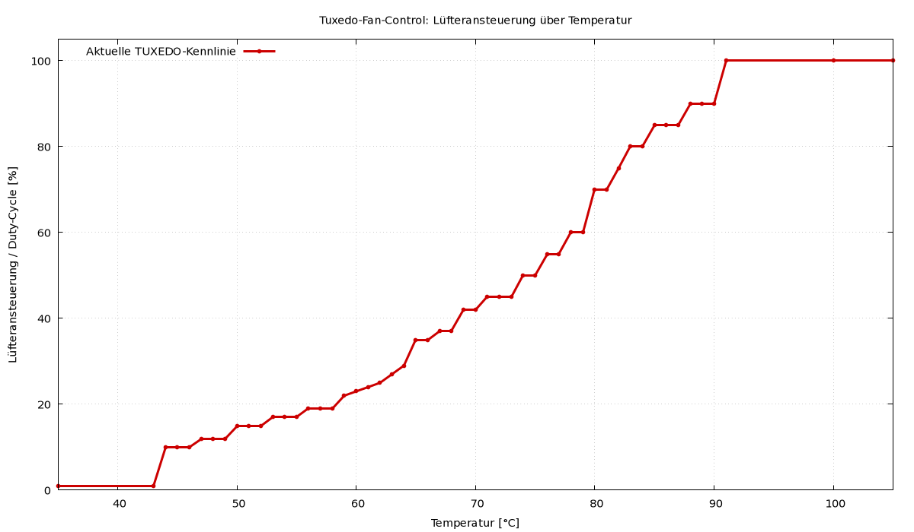

# Tuxedo-Fan-Control

Automatic fan control for compatible Tuxedo/Clevo laptops. The controller reads
the embedded-controller temperature and applies a selectable TUXEDO fan profile
to the EC fan-control channel.

## Fan profiles

The daemon provides the TUXEDO Control Center profiles `silent`, `quiet`,
`balanced`, `cool`, and `freezy`. Because the EC interface currently supplies
one local temperature only, the implementation uses the documented CPU curve
for each profile. `balanced` is the default.



The profile can be passed directly:

```sh
Tuxedo-Fan-Control --profile quiet
```

The systemd unit reads `/etc/default/tuxedo-fan-control`. To select a profile,
create that file with, for example:

```sh
TUXEDO_FAN_PROFILE=quiet
```

If the file is absent or its value is invalid, the daemon logs a warning and
uses `balanced`.
Changing the active profile requires an intentional service restart. The
percentage is converted with rounding to the EC range 0–255. The complete
tables, their thermal implications, and the EC conversion are documented in
[TECHNICAL_ANALYSIS.md](TECHNICAL_ANALYSIS.md).

## Prerequisites

```sh
sudo apt install -y g++ make cmake
```

The program accesses the embedded-controller I/O ports and therefore must run
as root.

Runtime EC and fan access also requires the TUXEDO kernel driver stack for the
target laptop. On current systems this is provided by `tuxedo-drivers`; older
installations may use the archived `tuxedo-keyboard` project. These packages
are not part of the default Debian or Ubuntu repositories in a standard
installation. Add the distribution-specific TUXEDO package repository and follow
TUXEDO's driver installation instructions before enabling this service. Then
verify that the required modules are installed and loaded, for example
`tuxedo_keyboard` and, where applicable, `tuxedo_io`:

```sh
lsmod | grep -E 'tuxedo_keyboard|tuxedo_io|tuxedo'
```

If Secure Boot blocks unsigned DKMS modules, the EC/fan interface can be
unavailable even though the driver package is installed. Enroll the module
signing key or disable Secure Boot according to the distribution's TUXEDO driver
instructions before starting this fan-control service.

EC buffer waits are bounded, briefly sleep between polls, and transaction
failures are reported explicitly. The daemon skips fan control when a
temperature read fails or the returned temperature is implausible. It exits with
an error after three consecutive failed control cycles, and the supplied systemd
unit then applies its rate-limited `Restart=on-failure` policy. During a
controlled shutdown or repeated implausible-temperature failure it attempts to
set the fan to the maximum profile value before exiting. Because the available
hardware documentation does not guarantee a model-independent emergency EC
command, direct EC communication failures still stop the daemon without issuing
a speculative recovery write.

## Build and install

```sh
make configure
make compile
ctest --test-dir build --output-on-failure
sudo make all
```

The Makefile is a compatibility wrapper around CMake. It configures and builds
the project, installs `Tuxedo-Fan-Control` in `/usr/local/bin`, installs and
enables `Tuxedo-Fan-Control.service`, and starts the service. The final command
is a system installation and must only be run after the tests have passed.
CMake generates the unit with an `ExecStart` path matching the selected
installation prefix. The unit runs as root with a reduced capability bounding
set for raw I/O, filesystem protection, restart backoff, and start-rate limits.

For direct CMake usage:

```sh
cmake -S . -B build -DCMAKE_BUILD_TYPE=Release
cmake --build build
ctest --test-dir build --output-on-failure
sudo cmake --install build --component runtime
sudo cmake --install build --component service
sudo systemctl enable Tuxedo-Fan-Control.service
```

The CTest suite checks the temperature and fan-speed boundary values as well as
EC timeout, transaction-error propagation, valid zero-byte handling, and the
consecutive-failure policy without accessing the laptop's EC. The tests must
pass before an installation or release build.

## Containerized quality checks

The project provides a Debian-based Docker image containing the C++ and
Markdown quality tools. Build the image and run all checks with:

```sh
docker build -t tuxedo-fan-control-quality:bookworm docker/quality
docker run --rm --network none \
  -v "$PWD:/workspace" \
  -w /workspace \
  tuxedo-fan-control-quality:bookworm
```

The container runs `clang-format`, `clang-tidy`, CMake/CTest, Prettier and
markdownlint. It does not access the laptop EC and does not install the
software on the host.

## Debian package

The Debian package is built in a dedicated Debian Bookworm container. Unit
tests run inside the container before CPack is allowed to create the package.
For a local package build, use:

```sh
docker build -t tuxedo-fan-control-package docker/package
mkdir -p package-output
docker run --rm --network none \
  --user "$(id -u):$(id -g)" \
  -e PACKAGE_VERSION=0.1.0 \
  -v "$PWD:/workspace:ro" \
  -v "$PWD/package-output:/output" \
  tuxedo-fan-control-package
```

The generated `.deb` file and its SHA-256 checksum are written to
`package-output/`. The package installs the executable below `/usr/bin`, the
systemd unit below `/usr/lib/systemd/system`, the administrator manpage and
the project documentation. Installing the package does not automatically
enable or start the hardware-specific service. The package declares `systemd`
and generated shared-library dependencies such as `libc6`, `libgcc-s1`, and
`libstdc++6`; it does not install the hardware-specific TUXEDO kernel drivers.

The GitHub Actions workflow `Debian package` performs the same containerized
build for pull requests and pushes to `master`, for tags beginning with `v`,
and when started manually. Commit builds receive a version of the form
`0.0.0+git<commit>.<run>`. A tag such as `v0.1.0` produces package version
`0.1.0`; a manual run can supply its own Debian-compatible version. Every
workflow run publishes the package and checksum as downloadable artifacts.
Tag builds additionally create a GitHub Release and attach the `.deb` package
and its SHA-256 checksum as permanent release assets.

The CMake install step does not start or restart the service automatically.

The installation also provides the administrator manpage:

```sh
man 8 Tuxedo-Fan-Control
```

It is installed as `Tuxedo-Fan-Control.8` below
`${CMAKE_INSTALL_PREFIX}/share/man/man8`.

Check the service with:

```sh
systemctl status -n20 Tuxedo-Fan-Control.service
```

For verbose logging, use:

```sh
sudo make VERBOSE=ON all
```

To remove the installation:

```sh
sudo make uninstall
```

## Original author and source

This project is based on the original **Clevo-N151ZU-fan-controller** by
**François Kneib**.

Original source repository:

<https://gitlab.com/francois.kneib/clevo-N151ZU-fan-controller>

Please preserve this attribution when redistributing or modifying the
software.

## License

This project is licensed under the GNU General Public License v3 or any later
version. See [LICENSE](LICENSE).
